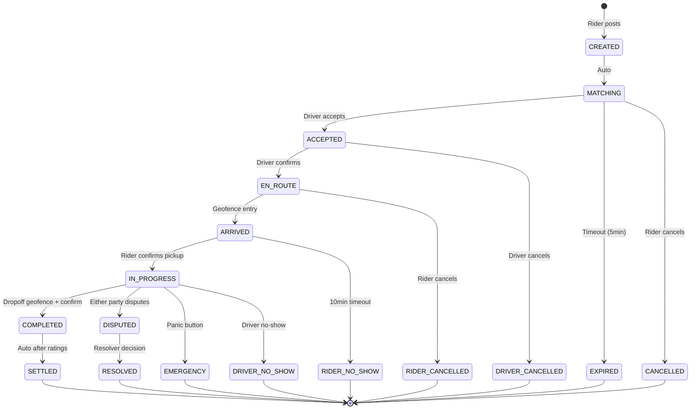

# 🚗 HORIZON RIDES VERTICAL — COMPREHENSIVE ANALYSIS

**Version:** 1.0 — Analysis & Debate Document  
**Date:** December 2025  
**Author:** Claude (for JollyV/Ruben de Macedo)

---

## Table of Contents

- [EXECUTIVE SUMMARY](#executive-summary)
- [1. XP VALUE ANALYSIS](#1-xp-value-analysis)
- [2. DRIVER RANKING TIERS ANALYSIS](#2-driver-ranking-tiers-analysis)
- [3. FEE STRUCTURE ANALYSIS](#3-fee-structure-analysis)
- [4. GEOFENCE SIZE RECOMMENDATIONS](#4-geofence-size-recommendations)
- [5. EQUIPMENT PROGRESSION SYSTEM](#5-equipment-progression-system)
- [6. VERIFICATION & COMPLIANCE](#6-verification--compliance)
- [7. EMERGENCY FEATURES](#7-emergency-features)
- [8. CANCELLATION POLICY ANALYSIS](#8-cancellation-policy-analysis)
- [9. HYBRID PRICING MODEL](#9-hybrid-pricing-model)
- [10. GUILD HIERARCHY STRUCTURE](#10-guild-hierarchy-structure)
- [11. MISSION LIFECYCLE](#11-mission-lifecycle)
- [12. NEXT STEPS](#12-next-steps)
- [QUESTIONS REQUIRING YOUR INPUT](#questions-requiring-your-input)

---

## EXECUTIVE SUMMARY

This document provides thorough analysis for all design decisions required to build the Rides vertical on Horizon Protocol. Based on our debate, the following decisions are **CONFIRMED**:

| Area | Decision |
|------|----------|
| Mission Pattern | Both Rider-as-Poster (primary) AND Driver-as-Poster (occasional rides) |
| Surge Pricing | Guild-controlled + Market algorithm (algorithm TBD) |
| XP System | Hybrid (Global XP + Rides-specific XP) |
| Guild Curation | Bidirectional (drivers AND riders curated) |
| Reputation | Bidirectional (both rate each other, both visible) |
| Real-time Tracking | Opt-in but RECOMMENDED; rider always sees driver |
| Route Recording | Full route, shareable for safety |
| Equipment System | Multiple funding paths (driver/guild/brand/earned) |
| Verification | Device attestation + driver's license + vehicle registration |
| Insurance | Driver responsibility OR guild-provided |
| Platform Liability | Infrastructure only — guilds handle compliance |
| Emergency Features | Panic button, trip sharing, audio recording |
| Pricing | Hybrid of all models (guild rates + market + distance + rider-set) |
| Cancellation | Fair for both parties, penalties for post-accept driver cancels |
| Wait Time | Per-minute charge + minor reputation signal |
| Multi-stop | Price recalculation, can be shared rides, multi-rider payouts |

**Related Documentation:**
- [Rides Matching Engine Specification](./RidesVertical_MatchingEngine.md)

---

## 1. XP VALUE ANALYSIS

### 1.1 Methodology

To determine fair XP values, I analyzed:
- **Time Investment:** Average ride = 15-30 minutes (varies widely)
- **Risk Level:** Medium (road safety, passenger interaction)
- **Skill Required:** Driving skill, navigation, customer service
- **Frequency:** Active drivers: 15-30 rides/day; Casual: 2-5/day
- **Comparison:** Standard Horizon mission completion = ~10-50 XP (estimated)

### 1.2 Proposed XP Values for Rides

| Action | XP | Rationale |
|--------|-----|-----------|
| **Driver Actions** | | |
| Complete standard ride | 12 XP | ~15-20 min avg, moderate complexity |
| Complete premium ride | 18 XP | Higher standards, selected drivers |
| Complete accessibility ride | 22 XP | Specialized skills, equipment needed |
| Complete long-distance (>30km) | +8 bonus | Extended time commitment |
| Complete shared ride (multiple riders) | +5 per additional rider | Coordination complexity |
| 5-star rating received | +3 bonus | Reward excellence |
| **Rider Actions** | | |
| Complete ride as rider | 3 XP | Lower effort, but participation matters |
| First ride with new guild | +2 bonus | Encourage guild exploration |
| 5-star rating given | +1 bonus | Reward engagement |
| **Guild/Social Actions** | | |
| Refer new driver (after 10 rides) | 50 XP | Growth incentive |
| Equipment milestone achieved | 25 XP | Progression reward |
| Dispute resolved in your favor | 15 XP | Justified disputes |
| Dispute resolved against you | -10 XP | Accountability |

### 1.3 Streak Bonuses (Rides-Specific)

Using existing protocol streak system, but applied to Rides XP:

| Streak Length | Daily Rides XP Bonus |
|---------------|---------------------|
| 3-6 consecutive days | +4 XP per ride |
| 7-13 consecutive days | +8 XP per ride |
| 14-29 consecutive days | +12 XP per ride |
| 30+ consecutive days | +20 XP per ride |

**Analysis:** A driver doing 15 rides/day on a 30+ day streak would earn:
- Base: 15 × 12 = 180 XP/day
- Streak bonus: 15 × 20 = 300 XP/day
- Total: 480 XP/day (~14,400 XP/month)

---

## 2. DRIVER RANKING TIERS ANALYSIS

### 2.1 Progression Timeline Analysis

| Driver Type | Rides/Day | Days to Expert (5,000 XP) |
|-------------|-----------|---------------------------|
| Full-time (no streak) | 20 rides | ~21 days |
| Full-time (with streak) | 20 rides | ~11 days |
| Part-time (no streak) | 5 rides | ~83 days |
| Part-time (with streak) | 5 rides | ~42 days |

### 2.2 Proposed Driver Ranking Tiers

| Tier | Rides XP | Title | Approx. Rides | Benefits |
|------|----------|-------|---------------|----------|
| 1 | 0 | **Rookie** | 0 | Basic access, standard queue |
| 2 | 300 | **Driver** | ~25 rides | Verified badge visible to riders |
| 3 | 1,500 | **Pro Driver** | ~125 rides | Priority queue, see rider ratings before accept |
| 4 | 5,000 | **Expert** | ~420 rides | Access premium ride board, streak bonus +10% |
| 5 | 15,000 | **Master** | ~1,250 rides | Guild officer eligibility, reduced wait penalties |
| 6 | 50,000 | **Legend** | ~4,200 rides | Protocol governance voting, exclusive NFT, equipment discounts |

### 2.3 Protocol Fee Discount Analysis

**Why I suggested -10% at Expert tier:**
- Reward loyalty
- Competitive with Uber/Lyft driver rewards
- Encourage drivers to stay on platform

**Why permanent discount might be problematic:**
- Reduces protocol revenue by ~10% from best drivers
- Creates expectation of entitlements
- Hard to reverse without community backlash

**PROPOSED ALTERNATIVE: Streak-Based Fee Reduction**

Instead of permanent tier-based discounts, implement **temporary streak-based fee reductions**:

| Streak Length | Protocol Fee Reduction | Duration |
|---------------|------------------------|----------|
| 7+ consecutive days | -3% | While streak active |
| 14+ consecutive days | -5% | While streak active |
| 30+ consecutive days | -8% | While streak active |
| 60+ consecutive days | -10% | While streak active |

**Benefits:**
- Rewards consistent activity, not just accumulated history
- Driver loses benefit if they stop driving (encourages retention)
- Protocol revenue protected during low-activity periods
- Aligns incentives: drive more = save more

**ALTERNATIVE 2: Guild-Subsidized Discounts**

Guilds can choose to subsidize member fees from their treasury:
- Guild sets `memberFeeSubsidy` parameter (0-50% of guild fee)
- High-reputation guilds can attract drivers with better economics
- Protocol fee remains unchanged; guild absorbs the cost

---

## 3. FEE STRUCTURE ANALYSIS

### 3.1 Current Protocol Fee Model

```text
F_proto = R × φ (protocol fee)
F_guild = R × γ (guild fee, if applicable)
DDR = R × δ (dispute reserve, refunded if no dispute)
LPP = R × π (loser-pays penalty, only in disputes)
```

### 3.2 Proposed Rides-Specific Parameters

| Parameter | Standard Missions | Rides Vertical | Rationale |
|-----------|-------------------|----------------|-----------|
| φ (protocol fee) | ~5% | **4%** | High-frequency, lower margin |
| γ (guild fee) | 2-5% | **2-4%** | Competitive with lower total take |
| δ (DDR factor) | 8-10% | **5%** | Rides have lower dispute rates |
| π (LPP factor) | ~5% | **5%** | Same accountability |

**Total Take Comparison:**

| Platform | Driver Take | Platform Take |
|----------|-------------|---------------|
| Uber/Lyft | ~70-75% | ~25-30% |
| Horizon Rides (no guild) | ~96% | ~4% |
| Horizon Rides (guild) | ~92-94% | ~6-8% |

**This is a massive competitive advantage.**

### 3.3 Wait Time Charges

**Proposal:**

| Wait Scenario | Grace Period | Per-Minute Charge | Max Charge |
|---------------|--------------|-------------------|------------|
| Driver waiting for rider | 5 minutes | $0.25/min | $5.00 |
| Rider waiting for driver | 3 minutes | $0.15/min | $3.00 |

**Reputation Impact (secondary signal):**
- Excessive waits (>10 min caused) = -1 reputation point
- Pattern of waits = flagged for review

---

## 4. GEOFENCE SIZE RECOMMENDATIONS

### 4.1 What Geofences Influence

| Geofence Type | Purpose | Consequences |
|---------------|---------|--------------|
| **Pickup Zone** | Verify driver arrived at pickup | Unlocks "arrived" status, starts wait timer |
| **Dropoff Zone** | Verify ride completed at destination | Triggers completion flow, rating prompt |
| **En-Route Activation** | Driver starts heading to rider | Rider sees "driver on the way", ETA starts |
| **Detour Detection** | Route deviation monitoring | Safety alerts, potential dispute evidence |

### 4.2 Recommended Geofence Sizes

| Geofence | Radius | Rationale |
|----------|--------|-----------|
| **Pickup verification** | 75m | Accounts for GPS drift, parking, building entrances |
| **Dropoff verification** | 75m | Same as pickup |
| **"Driver approaching"** | 200m | Gives rider time to prepare |
| **"Driver arrived"** | 100m | Notification to rider |
| **Route corridor** | 500m from optimal route | Allows reasonable detours, flags major deviations |

### 4.3 GPS Accuracy Considerations

- Modern smartphones: ±5-15m accuracy (good conditions)
- Urban canyons: ±30-100m accuracy (buildings block signals)
- Indoor/parking garages: May lose signal entirely

**Mitigation:**
- Use grace buffers (100m for parking situations)
- Allow manual override with photo/confirmation
- NFC tap option at designated pickup points

---

## 5. EQUIPMENT PROGRESSION SYSTEM

### 5.1 Realistic Equipment Tiers (Based on Research)

Based on rideshare driver equipment research, here are realistic, affordable tiers:

| Milestone | Rides Required | Equipment | Est. Cost | Funded By |
|-----------|----------------|-----------|-----------|-----------|
| **Starter** | 25 | Phone mount + USB charger | $25-40 | Driver purchase OR guild welcome kit |
| **Bronze** | 100 | LED indicator sign (brand badge) | $15-30 | Guild treasury OR earned |
| **Silver** | 300 | Dual dash cam (front + cabin) | $150-250 | Partial subsidy + driver |
| **Gold** | 750 | Premium kit: seat covers, floor mats, passenger charger, air freshener set | $100-150 | Guild reward OR brand sponsorship |
| **Platinum** | 1,500 | Professional 3-channel dash cam + cloud storage | $300-400 | Guild reward OR earned |
| **Diamond** | 3,000 | Full branded interior package + exclusive collectible NFT | $200-300 + NFT | Brand partnership OR guild |

### 5.2 Equipment Funding Model

**Multi-Path Funding System:**

```text
┌─────────────────────────────────────────────────────────────┐
│                    EQUIPMENT FUNDING PATHS                   │
├─────────────────────────────────────────────────────────────┤
│                                                             │
│  PATH A: Driver Self-Purchase                               │
│  └── Driver buys equipment independently                    │
│  └── Submits receipt → receives Equipment Badge NFT         │
│  └── Badge proves equipment ownership                       │
│                                                             │
│  PATH B: Guild Treasury Reward                              │
│  └── Complete X guild missions → unlock equipment reward    │
│  └── Guild treasury funds equipment purchase                │
│  └── Equipment shipped via SupplyGuild mission              │
│                                                             │
│  PATH C: Brand Sponsorship                                  │
│  └── Brand posts equipment mission to SupplyGuild           │
│  └── Eligible drivers apply (badge requirement)             │
│  └── Brand ships equipment → driver confirms → badge mint   │
│                                                             │
│  PATH D: Earned Through Missions                            │
│  └── "Equipment Fund" accumulates from ride earnings        │
│  └── Driver opts into 1-3% auto-deduction                   │
│  └── Fund unlocks equipment at thresholds                   │
│  └── Self-funded but automatic                              │
│                                                             │
│  PATH E: Guild Onboarding Requirement                       │
│  └── Certain guilds require equipment for membership        │
│  └── Guild provides equipment as "joining mission"          │
│  └── Driver completes X rides to "earn" the equipment       │
│  └── If driver leaves early, equipment cost deducted        │
│                                                             │
└─────────────────────────────────────────────────────────────┘
```

### 5.3 Equipment NFT System

```solidity
struct EquipmentBadge {
    uint256 badgeId;
    address driver;
    EquipmentTier tier;        // Starter, Bronze, Silver, Gold, Platinum, Diamond
    EquipmentType itemType;    // PhoneMount, DashCam, LEDSign, etc.
    uint256 acquiredAt;
    bytes32 proofHash;         // Receipt or delivery confirmation
    bool isGuildIssued;        // true if funded by guild
    address issuingGuild;      // guild that issued (if applicable)
}
```

---

## 6. VERIFICATION & COMPLIANCE

### 6.1 Required Verifications

| Verification | Storage | Who Validates | Frequency |
|--------------|---------|---------------|-----------|
| Device Attestation | On-chain proof hash | Protocol | Per session |
| Driver's License | Off-chain (encrypted vault) | Guild or 3rd party KYC | On join + annual |
| Vehicle Registration | Off-chain (encrypted vault) | Guild | On join + annual |
| Insurance (proof) | Off-chain | Guild | On join + annual |
| Background Check | Off-chain (pass/fail only) | 3rd party KYC provider | On join |

### 6.2 Compliance Tiers

| Tier | Requirements | Jurisdictions |
|------|--------------|---------------|
| **Tier 0: P2P Rideshare** | Device attestation only | Unregulated markets, friends/family |
| **Tier 1: Basic** | + Driver's license | Lightly regulated markets |
| **Tier 2: Standard** | + Vehicle registration + Insurance proof | Most markets (EU, US states) |
| **Tier 3: Full** | + Background check + Commercial license | Highly regulated (NYC, London) |

**Guild Compliance Model:**
- Each guild declares its compliance tier
- Guilds in regulated markets MUST meet Tier 2+ requirements
- Protocol provides infrastructure; guild handles enforcement
- Non-compliant guilds can be flagged/delisted by ProtocolDAO

### 6.3 Platform Liability Protection

**Horizon Protocol Position:**
- Protocol is **infrastructure** connecting independent parties
- Horizon does **NOT** set prices (dynamic market discovery)
- Horizon does **NOT** employ drivers (they're independent guild members)
- Horizon does **NOT** operate rides (guilds coordinate, users transact)

**Legal Language (for Terms of Service):**
```text
Horizon Protocol provides decentralized coordination infrastructure.
Guilds operate as independent organizations responsible for:
- Member verification and compliance
- Local regulatory adherence
- Service quality standards

Users transact directly via smart contract escrow.
Horizon Labs does not control, direct, or operate any rides.
```

---

## 7. EMERGENCY FEATURES

### 7.1 Panic Button

**Trigger:** User presses emergency button in app

**Actions:**
1. GPS location captured and timestamped
2. Audio recording begins (if not already active)
3. Alert sent to:
   - Guild curators/officers (if guild mission)
   - User's designated emergency contacts
   - Optional: Local emergency services API (where available)
4. Other party notified: "Safety alert triggered"
5. Mission state updated to "EMERGENCY" (escrow frozen)

### 7.2 Trip Sharing

**Features:**
- Share live trip link with contacts before/during ride
- Link shows: driver/rider info, live location, ETA, route
- Recipients can view but not interact
- Automatic expiry after trip completion + 1 hour

### 7.3 Audio Recording

**Implementation:**
- Opt-in at ride start (both parties see recording indicator)
- Stored locally on device OR encrypted cloud (user choice)
- 30-day automatic deletion (configurable)
- Available for dispute evidence submission
- Legal disclosure: "This ride may be recorded for safety"

---

## 8. CANCELLATION POLICY ANALYSIS

### 8.1 Cancellation Scenarios & Proposed Policies

| Scenario | Who Pays | Amount | Reputation Impact |
|----------|----------|--------|-------------------|
| **Rider cancels before match** | Rider | $0 (full refund) | None |
| **Rider cancels after match, before driver en route** | Rider | $1-2 service fee | Minor (-1 if pattern) |
| **Rider cancels after driver en route** | Rider | $3-5 + $0.50/km driven | -2 reputation |
| **Rider cancels after driver arrived** | Rider | $5-8 "no-show" fee | -3 reputation |
| **Rider no-show (10+ min wait)** | Rider | $5-8 no-show + wait fees | -5 reputation |
| **Driver cancels before pickup** | Driver | Loses priority queue | -3 reputation |
| **Driver cancels after accepting** | Driver | Potential suspension | -5 reputation |
| **Driver no-show** | Driver | Penalty from DDR | -10 reputation |

### 8.2 Fair Balance Principles

1. **Early cancels are cheap:** Allow flexibility when no one has invested time
2. **Later cancels cost more:** Compensate the inconvenienced party
3. **Patterns matter more:** Single cancels = minor impact; repeated = escalating
4. **Both parties accountable:** Riders can be bad too

---

## 9. HYBRID PRICING MODEL

### 9.1 Price Discovery Flow

```text
┌────────────────────────────────────────────────────────────────┐
│                    HYBRID PRICING MODEL                         │
├────────────────────────────────────────────────────────────────┤
│                                                                │
│  LAYER 1: Distance-Based Estimate (Foundation)                 │
│  └── Algorithm calculates: base + (distance × rate) + (time)  │
│  └── Uses local cost data, traffic, time of day               │
│  └── Provides "Suggested Price" range                         │
│                                                                │
│  LAYER 2: Guild Rate Overlay                                   │
│  └── Guilds set minimum/maximum rates for their drivers       │
│  └── Premium guilds can set higher minimums                   │
│  └── Guild rates override base if higher                      │
│                                                                │
│  LAYER 3: Market Discovery (Surge/Demand)                      │
│  └── Algorithm monitors: active requests vs available drivers │
│  └── Surge multiplier: 1.0x - 3.0x (guild-configurable max)   │
│  └── Riders see surge indicator before requesting             │
│                                                                │
│  LAYER 4: Rider Price Setting                                  │
│  └── Rider can offer ABOVE suggested price (tips/priority)    │
│  └── Rider can request BELOW (may wait longer for match)      │
│  └── Minimum: Guild minimum OR base estimate, whichever higher│
│                                                                │
│  LAYER 5: Driver Acceptance                                    │
│  └── Driver sees final offer (all layers combined)            │
│  └── Driver accepts or declines based on their preferences    │
│  └── Multiple drivers can compete for desirable rides         │
│                                                                │
└────────────────────────────────────────────────────────────────┘
```

### 9.2 Price Calculation Example

**Scenario:** 10km ride, moderate demand, PremiumRidesGuild driver

```text
Base estimate:
  Base fare: $2.50
  Distance: 10km × $1.20/km = $12.00
  Estimated time: 20min × $0.25/min = $5.00
  Subtotal: $19.50

Guild overlay:
  PremiumRidesGuild minimum: $22.00
  Applied price: $22.00 (guild minimum higher)

Market adjustment:
  Demand level: 1.3x surge
  Adjusted price: $22.00 × 1.3 = $28.60

Rider offer:
  Rider accepts suggested: $28.60
  OR Rider offers higher: $32.00 (faster match)
  OR Rider offers lower: $25.00 (longer wait)

Final offer to driver: $28.60 (or rider's custom offer)
```

### 9.3 Multi-Rider Shared Rides

**Price Splitting Logic:**

```text
Total route cost: $30.00
Rider A: Full route (pickup A → dropoff A)
Rider B: Partial route (pickup B → dropoff B, during A's ride)

Allocation method: Distance proportional

Rider A solo segments: 5km
Shared segment: 8km
Rider B solo segment: 2km

Rider A pays: (5 + 8/2) / 15 × $30 = $18.00
Rider B pays: (8/2 + 2) / 15 × $30 = $12.00

Driver receives: $30.00 (full fare)
```

---

## 10. GUILD HIERARCHY STRUCTURE

### 10.1 Proposed Guild Architecture

```text
                    ┌─────────────────────────┐
                    │    RidesMetaGuild       │
                    │  (Vertical Umbrella)    │
                    │                         │
                    │  • Sets interop standards│
                    │  • Cross-guild disputes │
                    │  • Shared equipment     │
                    │    suppliers            │
                    └───────────┬─────────────┘
                                │
        ┌───────────────────────┼───────────────────────┐
        │                       │                       │
        ▼                       ▼                       ▼
┌───────────────┐     ┌───────────────┐     ┌───────────────┐
│  Geographic   │     │   Specialty   │     │   Quality     │
│   Guilds      │     │    Guilds     │     │    Tiers      │
├───────────────┤     ├───────────────┤     ├───────────────┤
│ LisbonRides   │     │ EcoRidesGuild │     │ PremiumRides  │
│ PortoRides    │     │ (EV/Hybrid)   │     │ (4.8+ rating) │
│ MadridRides   │     │               │     │               │
│ LondonRides   │     │ AccessRides   │     │ BudgetRides   │
│ etc.          │     │ (Wheelchair)  │     │ (Economy)     │
│               │     │               │     │               │
│               │     │ NightOwls     │     │ LuxuryRides   │
│               │     │ (Late night)  │     │ (High-end)    │
│               │     │               │     │               │
│               │     │ AirportPro    │     │               │
│               │     │ (Airport runs)│     │               │
└───────────────┘     └───────────────┘     └───────────────┘
```

### 10.2 Guild Eligibility Examples

**LisbonRidesGuild (Geographic):**
```json
{
  "minGlobalXP": 100,
  "minRidesXP": 0,
  "minReputation": 60,
  "requiredBadges": [],
  "geographicZone": "Lisbon Metro Area",
  "complianceTier": 2,
  "customRequirements": {
    "language": ["Portuguese", "English"]
  }
}
```

**PremiumRidesGuild (Quality):**
```json
{
  "minGlobalXP": 500,
  "minRidesXP": 300,
  "minReputation": 85,
  "requiredBadges": ["DRIVER_VERIFIED", "DASHCAM_EQUIPPED"],
  "customRequirements": {
    "averageRating": 4.8,
    "completionRate": 95,
    "vehicleAge": "< 5 years"
  }
}
```

**Rider Eligibility for Premium Guild:**
```json
{
  "minRidesCompleted": 20,
  "minRatingGiven": 4.5,
  "maxDisputeRate": 2,
  "activeDisputes": 0
}
```

---

## 11. MISSION LIFECYCLE

### 11.1 State Machine



### 11.2 State Transition Rules

| From | To | Trigger | Who Can Trigger |
|------|----|---------|-----------------|
| CREATED | MATCHING | Auto | System |
| MATCHING | ACCEPTED | Driver accepts | Driver |
| MATCHING | EXPIRED | Timeout (5min) | System |
| MATCHING | CANCELLED | Rider cancels | Rider |
| ACCEPTED | EN_ROUTE | Driver confirms | Driver |
| ACCEPTED | DRIVER_CANCELLED | Driver cancels | Driver |
| EN_ROUTE | ARRIVED | Geofence entry | System |
| EN_ROUTE | RIDER_CANCELLED | Rider cancels | Rider |
| ARRIVED | IN_PROGRESS | Rider confirms pickup | Rider |
| ARRIVED | RIDER_NO_SHOW | 10min timeout | System |
| IN_PROGRESS | COMPLETED | Dropoff geofence + confirm | Driver/Rider |
| IN_PROGRESS | DISPUTED | Either party disputes | Driver/Rider |
| IN_PROGRESS | EMERGENCY | Panic button | Driver/Rider |
| COMPLETED | SETTLED | Auto after ratings | System |
| DISPUTED | RESOLVED | Resolver decision | Resolver |

---

## 12. NEXT STEPS

After we align on this analysis, I will create:

1. **RidesDAO_Specification.docx** — Full technical spec following iTake/RestaurantDAO format
2. **Mermaid Diagrams:**
   - D30 — Standard Ride Mission Flow
   - D31 — Rides Guild Hierarchy
   - D32 — Equipment Progression System
   - D33 — Bidirectional Reputation Flow
   - D34 — Real-Time Tracking Architecture
   - D35 — Hybrid Pricing Model Flow
   - D36 — Cancellation & Penalty Logic
3. **Data Structure Definitions** — Solidity + TypeScript types
4. **API Endpoint Specifications** — REST + WebSocket events

---

## QUESTIONS REQUIRING YOUR INPUT

1. **XP Values:** Do the proposed values feel balanced? Should ride XP be higher/lower relative to other mission types?

2. **Streak-Based Fee Reduction:** Do you prefer this over permanent tier discounts? What about the 60-day max (-10%)?

3. **Equipment Funding:** Which paths should be available at launch? All five, or start simpler?

4. **Compliance Tiers:** Should Tier 0 (P2P only) exist, or require at least Tier 1 for all rides?

5. **Multi-Rider Pricing:** Is distance-proportional splitting fair, or should we use time-based?

6. **Geographic Guilds:** Should they be mutually exclusive (driver in only one) or allow overlap?

---

*Document prepared for debate. All values are proposals subject to refinement.*
